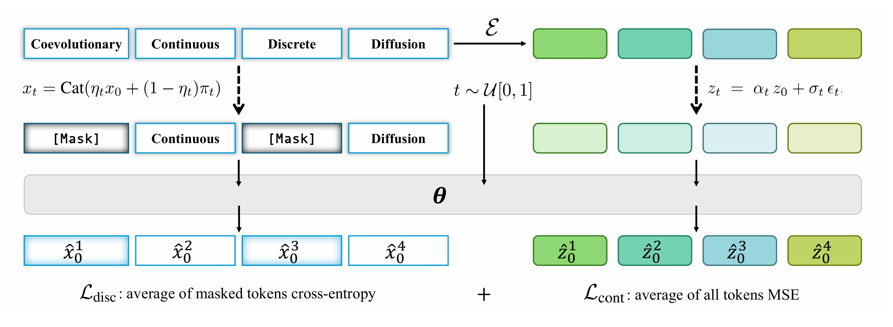

# Official Repository for ICML 2026 Paper: CCDD

<h1>Coevolutionary Continuous Discrete Diffusion: Make Your Diffusion Language Model a Latent Reasoner | ICML 2026</h1>

<div>
    <a href="https://homepage.zhouc.ai/" target="_blank">Cai Zhou</a><sup>1,2</sup> | 
    <a href="https://chr26195.github.io/" target="_blank">Chenxiao Yang</a><sup>3</sup> | 
    <a href="https://aheadofpotato.github.io/" target="_blank">Yi Hu</a><sup>4</sup> | 
    <a href="https://chenyuwang-monica.github.io/" target="_blank">Chenyu Wang</a><sup>1</sup> |
    <a href="https://lin-shan.com/" target="_blank">Chubin Zhang</a><sup>5</sup> |  
    <a href="https://muhanzhang.github.io/" target="_blank">Muhan Zhang</a><sup>4</sup> |  
    <a href="https://lmackey.github.io/" target="_blank">Lester Mackey</a><sup>2</sup> |  
    <a href="https://people.csail.mit.edu/tommi/tommi.html" target="_blank">Tommi Jaakkola</a><sup>1</sup> | 
    <a href="https://stephenbates19.github.io/index.html" target="_blank">Stephen Bates</a><sup>1</sup> |
    <a href="https://zdhnarsil.github.io/" target="_blank">Dinghuai Zhang</a><sup>2</sup> | 
</div>

<br>

<div>
    <sup></sup><sup>1</sup> Massachusetts Institute of Technology<br><sup>2</sup> Microsoft Research<br><sup>3</sup> Toyota Technological Institute at Chicago<br><sup>4</sup> Peking University<br><sup>5</sup> Tsinghua University
</div>

<br>

[](https://arxiv.org/abs/2510.03206)

## 💻 Overview

Coevolutionary Continuous-Discrete Diffusion (CCDD) is a text diffusion codebase for training and evaluating hybrid continuous/discrete denoising models. The implementation keeps the original GIDD-style training pipeline while adding CCDD model variants, continuous latent dynamics, and generation utilities.

<div style="width: 100%; text-align: center; margin:auto;">
    
</div>

## 🔧 Experiments

### Repository Layout

```text
CCDD/
├── ccdd/                 # Core implementation package
│   ├── eval/             # Sampling, decoding, self-correction, and loss evaluation
│   ├── models/           # DIT, MDIT, MMDIT, and MoeDiT model definitions
│   ├── checkpoints.py    # Checkpoint save/load helpers
│   ├── data.py           # Dataset and dataloader construction
│   ├── diffusion_process.py
│   ├── loss.py           # Diffusion objectives
│   ├── modeling.py       # Tokenizer/model factory helpers
│   ├── optimizer.py      # Optimizer factory
│   ├── pipeline.py       # Hugging Face-style pipeline wrapper
│   ├── sampling.py       # Samplers used by generation scripts
│   ├── train.py          # Main training entry point
│   └── trainer.py        # Training modules
├── configs/              # Hydra configs for training, generation, and evaluation
├── pyproject.toml
└── README.md
```

Use `ccdd` as the public import and module path. All implementation details reside under the `ccdd/` package directory.

### Installation

Create a fresh Python environment, then install the package in editable mode:

```bash
cd CCDD
python -m pip install --upgrade pip
python -m pip install -r requirements.txt
python -m pip install -e .
```

The core dependencies are listed in `requirements.txt` and `pyproject.toml`. Install a CUDA-compatible PyTorch build for your machine if the default wheel is not appropriate. `flash-attn` is optional and may improve throughput for supported GPUs, but it is not required to import or run the baseline code paths.

Editable installation is recommended, but source-tree execution is also supported from this directory.

### Configuration

CCDD uses Hydra. Most experiments are defined under `configs/`; defaults are composed from:

- `configs/logging/default.yaml` for logging, checkpoint cadence, and output directory.
- `configs/data/*.yaml` for dataset and tokenizer settings.
- `configs/model/*.yaml` for model scale.
- Top-level experiment configs such as `ccdd-small-mdit-qwen3-pr_1.yaml`, `ccdd-small-moedit-qwen3_contextual-linear_flow-pr_1.yaml`, and `ccdd.yaml`.

Public configs avoid machine-specific paths. Paths that depend on your local environment should be supplied as Hydra overrides, for example:

```bash
logging.save_dir=outputs/checkpoints
data.cache_dir=/path/to/dataset/cache
data.tokenizer_name=Qwen/Qwen3-Embedding-0.6B
model.pretrained_model_name=Qwen/Qwen3-Embedding-0.6B
training.resume=/path/to/checkpoint
```

Generation configs use `path: ???` when a checkpoint must be provided explicitly.

### Training

Single-process smoke run:

```bash
python -m ccdd.train --config-name ccdd \
  training.num_train_steps=10 \
  training.compile_model=false \
  logging.run_name=ccdd-smoke
```

Distributed training:

```bash
torchrun --nnodes 1 --nproc_per_node 8 -m ccdd.train \
  --config-name ccdd-small-moedit-qwen3_contextual-linear_flow-pr_1 \
  logging.run_name=ccdd-small-moedit \
  logging.save_dir=outputs/checkpoints
```

Common overrides:

```bash
training.resume=/path/to/checkpoint
training.dtype=bf16
training.train_batch_size=64
training.eval_batch_size=64
optimizer.lr=1e-4
```

Weights are saved under `logging.save_dir`. Hydra also writes per-run config snapshots under `outputs/` unless overridden.

### Generation

Generate token samples from a trained checkpoint:

```bash
python -m ccdd.eval.generate_samples \
  --config-name generate \
  path=/path/to/checkpoint \
  samples_path=samples.pt \
  num_samples=16 \
  batch_size=16 \
  max_length=512 \
  num_denoising_steps=128
```

Decode generated token IDs:

```bash
python -m ccdd.eval.decode \
  --path samples.pt \
  --tokenizer Qwen/Qwen3-Embedding-0.6B
```

The decoded text is written next to the `.pt` file as JSON.

### Evaluation

Compute validation loss for a checkpoint:

```bash
python -m ccdd.eval.loss \
  --config-name eval \
  path=/path/to/checkpoint \
  batch_size=16
```

Generative perplexity utilities are available in `eval/generative_ppl.py` and configured by `configs/gen_ppl.yaml`.

### Checkpoints

Training checkpoints store the model, optimizer, RNG state, tokenizer/config metadata, and training state used for resuming. Use `training.resume=/path/to/checkpoint` for continued training.

### Notes for Reproducibility

- Run commands from the `CCDD` directory. `pip install -e .` is recommended for experiments, but the source tree is self-contained for `python -m ccdd...` commands.
- Set `data.cache_dir` to a writable dataset cache location.
- Set `WANDB_MODE=offline` or disable W&B externally if you do not want online logging.
- Keep `training.compile_model=false` for quick debugging; enable it for long GPU runs after the first smoke test passes.
- Override all checkpoint paths explicitly when using generation or evaluation configs.

## 📎  Attribution

This release builds on the GIDD training and sampling structure and extends it with CCDD model and diffusion variants. If you find this repo useful, please cite the CCDD paper and any upstream baselines used in your experiments.

```bibtex
@inproceedings{zhou2026coevolutionary,
  title={Coevolutionary Continuous Discrete Diffusion: Make Your Diffusion Language Model a Latent Reasoner},
  author={Cai Zhou and Chenxiao Yang and Yi Hu and Chenyu Wang and Chubin Zhang and Muhan Zhang and Lester Mackey and Tommi Jaakkola and Stephen Bates and Dinghuai Zhang},
  booktitle={Forty-third International Conference on Machine Learning},
  year={2026}
}
